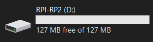
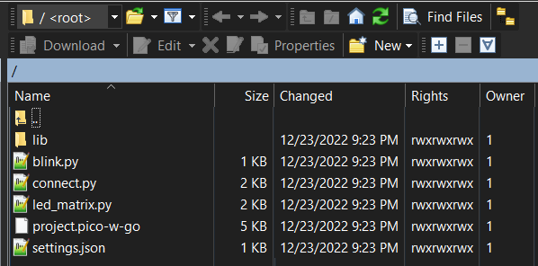
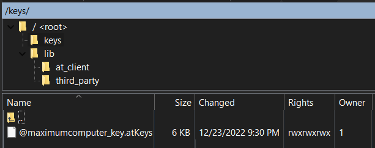
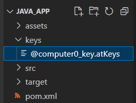
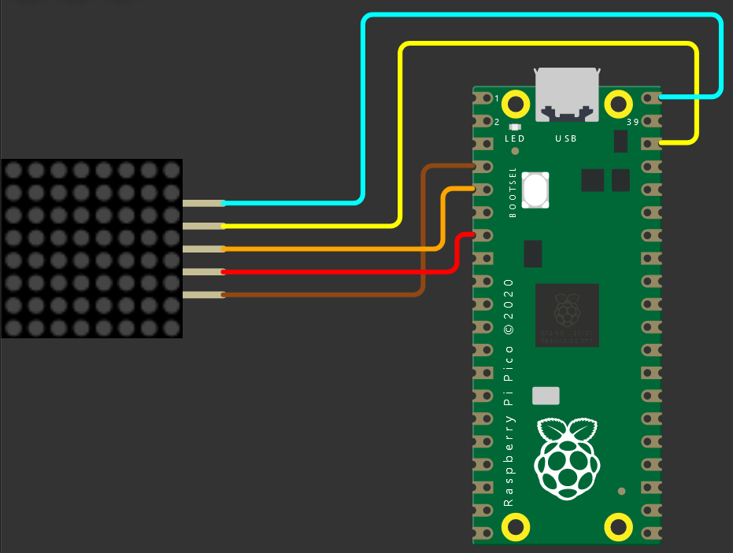
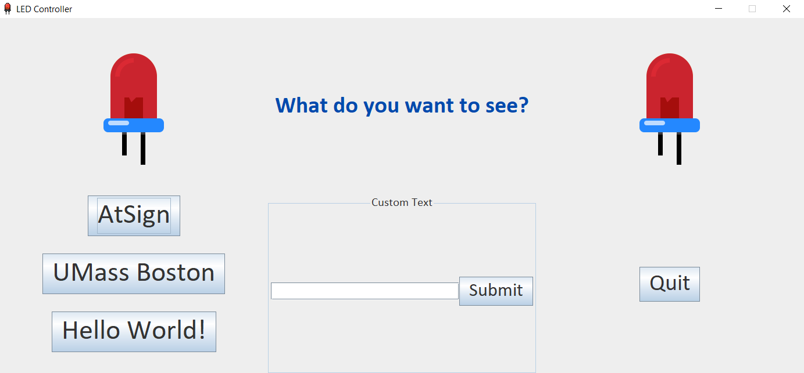

<h1>led-controller-project</h1>

Control LEDs using two atSigns. One atSign will be the application (terminal/app) sending data to the other atSign that will be the device atSign controlling the LEDs.

# Table of Contents

- [Table of Contents](#table-of-contents)
- [Hardware Requirements](#hardware-requirements)
- [Software Requirements](#software-requirements)
- [Instructions](#instructions)
  - [1. Download](#1-download)
  - [2. Configuring the atSigns](#2-configuring-the-atsigns)
  - [3. Installing MicroPython firmware](#3-installing-micropython-firmware)
  - [4. Testing the Pico](#4-testing-the-pico)
  - [5. Uploading the project](#5-uploading-the-project)
  - [6. Initializing the app](#6-initializing-the-app)
  - [7. Setting up the circuit](#7-setting-up-the-circuit)
    - [Circuit Diagram](#circuit-diagram)
    - [Connections](#connections)
  - [8. Running the app](#8-running-the-app)

# Hardware Requirements

- A [Raspberry Pi Pico W](https://www.canakit.com/raspberry-pi-pico-w.html)
  - A [data micro-USB to USB-A cable](https://www.amazon.com/dp/B0711PVX6Z) (to connect your Pico to your computer)
  - [Header pins](https://www.amazon.com/Pcs-Header-MazerPi-Raspberry-Pico/dp/B09F2NZ3GB) and [soldering equipment](https://www.amazon.com/dp/B08R3515SF) (if the Pico is not [pre-soldered](https://www.amazon.com/dp/B0BK9W4H2Q))
- A [MAX7219 8 x 32 LED Matrix](https://www.amazon.com/dp/B088LWLHP5)
  - Five female-to-female jumper cables (included in above link)

# Software Requirements

- [Git](https://git-scm.com/)
- [Visual Studio Code](https://code.visualstudio.com/Download)
  - [Pico-W-Go Extension](https://marketplace.visualstudio.com/items?itemName=paulober.pico-w-go)
  - [Maven for Java Extension](https://marketplace.visualstudio.com/items?itemName=vscjava.vscode-maven)
- Two [atSigns](https://my.atsign.com/go) and their [.atKeys](https://youtu.be/2Uy-sLQdQcA) files (can be generated from [these apps](https://atsign.com/apps/))
- [WinSCP](https://winscp.net), [FileZilla](https://filezilla-project.org/), or any other FTP software

# Instructions

## 1. Download

Open up a terminal in the folder you want to store this project, then download it via:

```
git clone https://github.com/Udaya-X2/led-controller-project
```

Next, navigate to the project directory and open Visual Studio Code via:

```
cd led-controller-project
code .
```

Once Visual Studio Code is open, you can close the old terminal. Open up an integrated terminal by clicking **View > Terminal** in the window (or <code>Ctrl + Shift + `</code>). This will be used in later steps.

## 2. Configuring the atSigns

In our presentation, we used the atSigns `@computer0` and `@maximumcomputer` on the Pico and Java app, respectively. Change these to the two atSigns you own by modifying the following files:

`led-controller-project/pico/settings.json`

```JSON
{
    "ssid": "<Enter Wi-Fi Network Here>",
    "password": "<Enter Wi-Fi Password Here>",
    "picoAtSign": "@maximumcomputer",
    "appAtSign": "@computer0"
}
```

`led-controller-project/java_app/settings.json`

```JSON
{
    "picoAtSign": "@maximumcomputer",
    "appAtSign": "@computer0"
}
```

Additionally, enter a Wi-Fi network name and password in the first `settings.json` file. This will be used by the Pico to connect to the internet and communicate via the atPlatform.

## 3. Installing MicroPython firmware

**Note: this step and the following two steps are adapted from JeremyTubongbanua's [README.md](https://github.com/JeremyTubongbanua/at_pico_w/blob/umass/README.md) for `at_pico_w`; all credit goes to them.**

1. Go to [atsign-foundation/micropython/releases](https://github.com/atsign-foundation/micropython/releases) and download the `.uf2` file.

2. Plug the Raspberry Pi Pico W into your computer while holding the BOOTSEL button. Once the Pico W is plugged in, you can let go of the BOOTSEL button. Your Pico W should now be in bootloader mode.

You should see the Pico on your computer as a USB drive (see image below).



3. Drag and drop the `firmware.uf2` file into the Pico W. This will flash the Pico W with the new firmware. Now the Pico W should automatically restart so no need to unplug/replug it.

## 4. Testing the Pico


1. Navigate to the `pico` directory and open up a new VS Code window from it:

```
cd pico
code .
```

You can close the old window after this step.

2. Open the command pallette via `Ctrl + Shift + P` (or `Cmd + Shift + P` if you are on a Mac), type `Configure Project`, and press Enter. The Pico-W-Go extension should set up your current folder as a Pico W project by initializing a `.vscode/` hidden folder and a `.picowgo` hidden file. Now, any Pico-W-Go commands should work. You can also access Pico-W-Go commands by clicking on "All Commands" at the bottom of VSCode.

3. Open `blink.py`. You should see a toolbar like this at the bottom of VS Code:


Click **Run** to run the program. You should see the on-board LED blink 5 times.

## 5. Uploading the project

1. Open the command pallette (`Ctrl + Shift + P`), type `Upload Project`, and press enter to upload the project files to the Pico. Your terminal output should look like this:

```
>>> 
Uploading project (main folder)...
Not safe booting, disabled in settings

Uploading to / ...
Reading file status
Creating dir lib
Creating dir lib/at_client
Creating dir lib/third_party
Creating dir lib/third_party/rsa
[1/36] Writing file 'blink.py' (263 bytes)
[2/36] Writing file 'connect.py' (2 kB)
[3/36] Writing file 'led_matrix.py' (1 kB)
[4/36] Writing file 'lib/aes.py' (1 kB)
[5/36] Writing file 'lib/at_client/at_client.py' (7 kB)
[6/36] Writing file 'lib/at_client/at_utils.py' (1 kB)
[7/36] Writing file 'lib/at_client/io_util.py' (1 kB)
[8/36] Writing file 'lib/at_client/keys_util.py' (4 kB)
[9/36] Writing file 'lib/at_client/remote_secondary.py' (4 kB)
[10/36] Writing file 'lib/max7219.py' (3 kB)
[11/36] Writing file 'lib/ntp_client.py' (1 kB)
[12/36] Writing file 'lib/pem_service.py' (7 kB)
[13/36] Writing file 'lib/third_party/io.py' (1 kB)
[14/36] Writing file 'lib/third_party/itertools.py' (3 kB)
[15/36] Writing file 'lib/third_party/logging.py' (3 kB)
[16/36] Writing file 'lib/third_party/rsa/asn1.py' (2 kB)
[17/36] Writing file 'lib/third_party/rsa/cli.py' (9 kB)
[18/36] Writing file 'lib/third_party/rsa/common.py' (5 kB)
[19/36] Writing file 'lib/third_party/rsa/core.py' (2 kB)
[20/36] Writing file 'lib/third_party/rsa/key.py' (24 kB)
[21/36] Writing file 'lib/third_party/rsa/machine_size.py' (2 kB)
[22/36] Writing file 'lib/third_party/rsa/parallel.py' (2 kB)
[23/36] Writing file 'lib/third_party/rsa/pem.py' (3 kB)
[24/36] Writing file 'lib/third_party/rsa/pkcs1.py' (15 kB)
[25/36] Writing file 'lib/third_party/rsa/pkcs1_v2.py' (3 kB)
[26/36] Writing file 'lib/third_party/rsa/prime.py' (5 kB)
[27/36] Writing file 'lib/third_party/rsa/randnum.py' (3 kB)
[28/36] Writing file 'lib/third_party/rsa/transform.py' (7 kB)
[29/36] Writing file 'lib/third_party/rsa/util.py' (3 kB)
[30/36] Writing file 'lib/third_party/rsa/_compat.py' (4 kB)
[31/36] Writing file 'lib/third_party/rsa/__init__.py' (2 kB)
[32/36] Writing file 'lib/third_party/string.py' (2 kB)
[33/36] Writing file 'lib/third_party/warnings.py' (1 kB)
[34/36] Writing file 'lib/uasn1.py' (14 kB)
[35/36] Writing file 'lib/wifi.py' (283 bytes)
[36/36] Writing file 'settings.json' (160 bytes)
Upload done, resetting board...
OK
```

If it does not look like the above, Pico-W-Go may be running into issues uploading the full project to the Pico. Try resetting the board, plugging the Pico in/out, reloading VS Code, deleting all files from the board, or uploading a single file to jumpstart the extension. If `Upload Project` works as intended, you should be able to see all 36 files get uploaded to the Pico.

2. Open the command pallette (`Ctrl + Shift + P`), type `Start FTP Server`, and press enter. You should be given an address in the terminal similar to the image below:

```
>>> 
Started FTP server: ftp://pico@127.0.0.1:2121
```

3. Open your FTP software and connect to this address. If it asks for a password, it should be `pico`. If you've uploaded and files to the Pico before, you should see them once you've connected. In WinSCP, the root directory looks like this:



4. Create a `keys` directory. This is where you will drag and drop the .atKeys file of your pico's atSign. Your `keys/` directory should look like this:



5. Close the FTP server by pressing "Stop" on the bottom toolbar of VSCode.

```
>>> 
Started FTP server: ftp://pico@127.0.0.1:2121

Stopped FTP server.
```

## 6. Initializing the app

1. Go to the integrated terminal (<code>Ctrl + Shift + `</code>) and open up a new VS Code window from the Java app directory (note: this assumes you are in the <code>led-controller-project/pico</code> directory).

```
code ../java_app
```

2. Create a `keys` directory in the workspace:


3. Drag and drop the app atSign's .atKeys file into it:



## 7. Setting up the circuit

After soldering header pins to your Raspberry Pi Pico W (or using a pre-soldered Pico), set up the IoT device by following the circuit diagram/pin connections table given below.

### Circuit Diagram



### Connections

| Raspberry Pi Pico W | MAX7219 8x8 LED Matrix |
| ------------------- | ---------------------- |
| VBUS                | VCC                    |
| GND                 | GND                    |
| MOSI (GP3)          | DIN                    |
| CS (GP5)            | CS                     |
| SCK (GP2)           | CLK                    |

## 8. Running the app

Now that both the IoT device and Java application are set up, we can finally run the app!

1. Open the VS Code window that is in the `led-controller-project/pico` directory. Then, open `connect.py`. Start up the IoT device by clicking **Run** at the bottom.

```
>>> Running c:\Users\UDAYA\OneDrive\Documents\GitHub\led-controller-project\pico\connect.py
 
Connecting to WiFi DESKTOP-UPDUQDD...
Wrote /keys/@maximumcomputer/aesEncryptPrivateKey_pem.json
Wrote /keys/@maximumcomputer/aesEncryptPublicKey_pem.json
Wrote /keys/@maximumcomputer/aesPkamPrivateKey_pem.json
Wrote /keys/@maximumcomputer/aesPkamPublicKey_pem.json
Sending from:@maximumcomputer
Challenge: _dfb8f01c-4413-4467-838d-bf802626fe1a@maximumcomputer:54c5856e-c3f3-475b-989f-d7980b3b5e0c
Digesting...
Signature: T2uR0fgwS8LTcwAGNiNTAi1HrFbSDJQVxqbvlLxQQKXZYwRjF60TrMCat7ZPMJRfuZeY7VJt2-Kq9-Ic2O3dpTK1qjqA0UE8qysIphoCM6otaaME7h6Zl_ccPldD5RzuE-rbHmQpQeEj57hv6vm6yaNnYZWRVdwdtRlwOySSoR5j3wYTNjc2deG0X_zHGjS1rCOVLzttQDxdAigBVbkO8WulHCB2N95pkUraZwOcROjsXQuGkBKGZGq_4VukR5oiLUjJNO5OsZDdjPn7tx2xtfsIZqqFfx-u3ywE-y98jnkaad_bwEL3pMlD-YypJl55nyhtBNlpWJgYyk_Tvox9IQ==
data:success
```

If everything went well, you should see output similar to what is shown above. If you encountered a MemoryError, ECONNABORTED error, or any other extraneous error, try resetting the board, plugging the Pico in/out, or reloading VS Code. This usually fixes those sporadic issues.

2. Open the VS Code window that is in the `led-controller-project/java_app` directory. Then, open `led-controller-project/java_app/src/main/java/io/github/ledproject/UI.java`. Start up the Java application by clicking **Run > (Run Without Debugging)** in the window (or `CTRL + F5`).



You should see a window like the above appear on your screen.

If you want to display a preset text option on the LED matrix, you can click any of the three buttons on the left. If you want to display a custom text option, simply enter text in the text field and press "Submit." When you are done, you can press "Quit" to exit the program (or click the 'X' at the top right window corner).

https://user-images.githubusercontent.com/41876812/209421772-63ee3a02-1a9e-40ba-9029-b3b5d1afb66a.mp4

Note:
* Clicking multiple buttons in succession (without waiting for the text to display) puts the display text in a queue, where they are then displayed by order of press on the LED matrix.
* Blank text will not be displayed on the LED matrix, and leading/trailing whitespace will always be stripped from custom text.
* The LED matrix may flash with all dots turned on right after the Pico connection code reaches `data:success`. This is a normal; it indicates the matrix is working.
* If the Pico loses internet access while the connection code is still running, you may see the previous text option get re-displayed on the LED matrix.

<h2>References</h2>

JeremyTubongbanua's atPlatform Communication Library for the Pico - [at_pico_w](https://github.com/JeremyTubongbanua/at_pico_w/tree/umass)

atsign-foundation's atPlatform Communication Library for Java - [at_java](https://github.com/atsign-foundation/at_java)

mcauser's MAX7219 8x8 LED Matrix Library - [micropython-max7219](https://github.com/mcauser/micropython-max7219)
